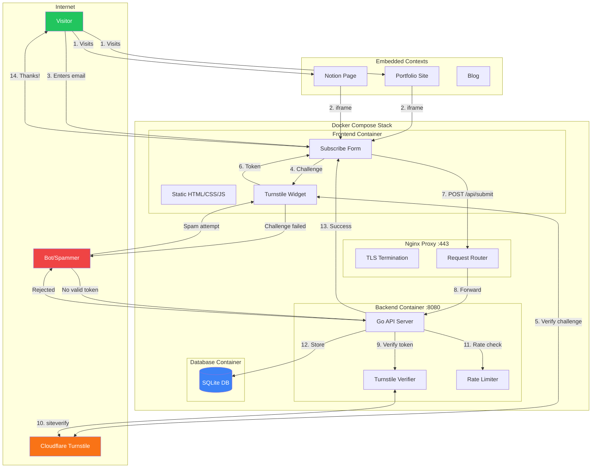

# Dropmail

A minimal, embeddable email collection form designed for zero-maintenance deployment. Built for collecting newsletter signups across multiple properties (portfolio sites, Notion pages, etc.) with bot protection and source tracking.

## Architecture



## Features

- **Embeddable**: Works in iframes on any site (Notion, portfolio, blogs)
- **Bot Protection**: Cloudflare Turnstile integration (free, privacy-focused)
- **Source Tracking**: Track which property each signup came from via `?source=` parameter
- **Zero Maintenance**: SQLite database, Docker restart policies, no cron jobs
- **Accessible**: WCAG 2.1 AA compliant (keyboard navigation, screen reader support)
- **Lightweight**: < 8KB total page weight (HTML + CSS + JS)
- **Secure**: HTTPS enforced, rate limiting, CORS protection

## Quick Start

### Prerequisites

- Docker & Docker Compose
- SSL certificates (or use Let's Encrypt)
- Cloudflare Turnstile site key and secret

### 1. Configure Environment

```bash
cp .env.example .env
```

Edit `.env`:
```env
TURNSTILE_SECRET=your-turnstile-secret-key
TURNSTILE_SITE_KEY=your-turnstile-site-key
CORS_ORIGINS=https://yourdomain.com,https://notion.so
```

### 2. Add SSL Certificates

Place your certificates in the `certs/` directory:
```
certs/
  cert.pem
  key.pem
```

### 3. Deploy

```bash
docker compose up -d
```

The form will be available at `https://yourdomain.com`

## Embedding

### Basic iframe

```html
<iframe
  src="https://yourdomain.com"
  width="100%"
  height="200"
  frameborder="0">
</iframe>
```

### With Source Tracking

```html
<iframe
  src="https://yourdomain.com?source=portfolio"
  width="100%"
  height="200"
  frameborder="0">
</iframe>
```

### Transparent Background (for themed sites)

```html
<iframe
  src="https://yourdomain.com?source=notion&transparent=1"
  width="100%"
  height="200"
  frameborder="0">
</iframe>
```

## Data Access

Emails are stored in SQLite at `/data/dropmail.db`. See [DATA_ACCESS.md](DATA_ACCESS.md) for:
- SQL queries for viewing submissions
- CSV export commands
- Backup procedures

### Quick Export

```bash
docker exec dropmail-backend sqlite3 /data/dropmail.db \
  ".mode csv" ".headers on" \
  "SELECT email, source, created_at FROM submissions ORDER BY created_at DESC;"
```

## Configuration

| Variable | Description | Required |
|----------|-------------|----------|
| `TURNSTILE_SECRET` | Cloudflare Turnstile secret key | Yes |
| `TURNSTILE_SITE_KEY` | Cloudflare Turnstile site key | Yes |
| `CORS_ORIGINS` | Comma-separated allowed origins | Yes |
| `DB_PATH` | SQLite database path (default: `/data/dropmail.db`) | No |
| `PORT` | Backend API port (default: `8080`) | No |

## Project Structure

```
dropmail/
├── docker-compose.yml      # Container orchestration
├── dropmail-backend/       # Go API server
│   ├── cmd/api/           # Main entrypoint
│   ├── internal/          # Business logic
│   └── migrations/        # Database schema
├── dropmail-frontend/      # Vite + TypeScript
│   ├── src/               # Source files
│   └── nginx.conf         # Static file serving
└── docker/
    ├── proxy/             # Nginx reverse proxy
    └── db/                # Database volume init
```

## Security

- **TLS 1.2+**: Modern cipher suites only
- **Rate Limiting**: 10 requests/minute per IP
- **Bot Protection**: Cloudflare Turnstile verification
- **Input Validation**: Email format + length limits
- **CORS**: Restricted to configured origins
- **CSP**: `frame-ancestors *` for iframe embedding

## License

MIT
